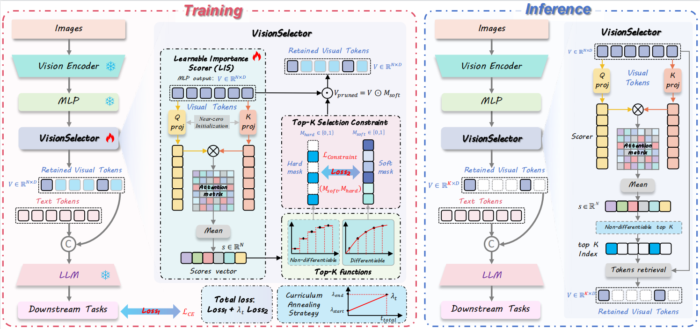

# Visual Token Compression for Efficient Multimodal LLMs

Research code for studying **visual token compression** in multimodal large language models (MLLMs) — reducing the number of visual tokens passed to the language model while preserving multimodal understanding.

This repository is based on the publicly released **VisionSelector** codebase and serves as a research starting point for experimentation, adaptation, and evaluation of visual token compression methods.

<p align="center">
  
</p>

---

## Overview

Multimodal LLMs process detailed visual information by converting images or videos into sequences of visual tokens. These sequences can become computationally expensive, especially with high-resolution images or long videos.

Visual token compression addresses this by reducing the number of visual tokens passed to the language model while trying to preserve the information most relevant to the downstream task.

This repository explores the problem through experiments with **learnable** and **non-learnable** token selection strategies, and currently supports **Qwen2.5-VL** and **LLaVA-OneVision**.

> **Core research question:** How can visual token sequences be compressed efficiently without substantially degrading multimodal understanding?

## Research Focus

- Visual token selection and pruning
- Token compression for multimodal LLMs
- Efficient multimodal inference
- Retention-rate vs. performance trade-offs
- Computational and memory efficiency
- Learnable, importance-based token selection
- Comparison across token compression strategies
- Evaluation of compressed multimodal models

The broader goal is to understand what visual information can be removed — and what must be preserved — when reducing the computational cost of MLLMs.

## Relationship to VisionSelector

This repository builds on the publicly available implementation of **VisionSelector: End-to-End Learnable Visual Token Compression for Efficient Multimodal LLMs**, which introduced an end-to-end learnable framework including a differentiable Top-K selection mechanism, curriculum-based training, and a learnable importance scorer.

VisionSelector is used here as a research baseline and implementation starting point. This repository is an **experimental / extended codebase**, not a reimplementation claiming ownership of the original method. For the original method, results, and publication, please refer to the original VisionSelector project and paper.

## Repository Structure

```
.
├── datasets/            # Dataset preparation and annotation utilities
├── docs/                # Documentation and figures
├── qwen-vl-finetune/    # Qwen2.5-VL training and token-selection experiments
├── qwen-evaluation/     # Evaluation and inference scripts
├── qwen-vl-utils/       # Supporting utilities
├── llava-ov-15/         # LLaVA-OneVision-1.5 experiments
├── lmms-eval/           # Multimodal benchmark evaluation
├── requirements.txt
└── README.md
```

## Dataset Preparation

The experimental pipeline uses datasets from the **Cambrian-10M** dataset collection:

| Dataset  | Approx. Size |
|----------|-------------:|
| OCR-VQA  | ~80K         |
| ChartQA  | ~28K         |
| TextVQA  | ~21K         |
| COCO     | ~364K        |

The corresponding annotation file is `Cambrian737k.jsonl`. These datasets are **not included** in this repository and should be obtained from their respective public sources.

After downloading, place them inside `datasets/` with roughly this structure:

```
datasets/
├── ocr_vqa/
├── ocr_vqa_cambrian.jsonl
├── chartqa/
├── chartqa_cambrian.jsonl
├── textvqa/
├── textvqa_cambrian.jsonl
├── coco/
├── coco_cambrian.jsonl
└── textvqa_ocrvqa_cambrian.jsonl
```

Then prepare the annotation files:

```bash
python datasets/filter_json.py
python datasets/sample_merge_json_llavaov.py
```

Exact commands and paths may need to be adjusted for your local dataset configuration.

## Environment Setup

```bash
conda create -n vision-compression python=3.10
conda activate vision-compression
pip install -r requirements.txt
```

**Qwen2.5-VL pipeline:**

```bash
pip install qwen-vl-utils[decord]
pip install transformers==4.50.0
```

**LLaVA-OneVision pipeline** (requires a different Transformers version):

```bash
pip uninstall transformers
pip install transformers==4.53.1
```

## Qwen2.5-VL Experiments

### Training

```bash
cd qwen-vl-finetune
bash scripts/sft_7b.sh       # or
bash scripts/sft_3b.sh       # or
bash scripts/sft_dynamic.sh
```

### Evaluation

```bash
cd lmms-eval
pip install -e .
cd ../qwen-evaluation

bash run_token_compression.sh   # general token compression
bash run_selector.sh            # selector-based evaluation
bash run_dynamic_qwen.sh        # dynamic token selection
```

### Inference

```bash
bash run_inference.sh
```

The pipeline measures how reducing the number of visual tokens affects:

- Multimodal task performance
- Number of visual tokens
- Inference latency
- Prefill time
- GPU memory consumption

### Efficiency Evaluation

Enable timing and resource measurements with:

```bash
EVAL_TIME=True
```

This records maximum GPU memory, prefill time, latency, and number of visual tokens — used to analyze the trade-off between token retention and computational efficiency.

## LLaVA-OneVision Experiments

Install the required environment and configure the appropriate Transformers version before running.

```bash
cd llava-ov-15
bash scripts/finetune_selector_8b.sh   # training
bash run_ov_token_compression.sh       # evaluation
bash run_ov_selector.sh                # selector-based evaluation
bash run_ov_inference.sh               # inference
```

## Experimental Directions

1. **Token retention** — model performance across budgets: `100% → 75% → 50% → 25% → 10%`
2. **Selection strategies** — comparing approaches for choosing which tokens to retain
3. **Efficiency** — token reduction vs. GPU memory, latency, prefill time, throughput
4. **Generalization** — does a selector trained at one retention rate hold up at others?
5. **Model comparison** — evaluating compression across multiple multimodal architectures, not just one backbone

## Current Status

This is an active research and experimentation codebase. New experiments, modifications, and findings will be documented as the research progresses.
